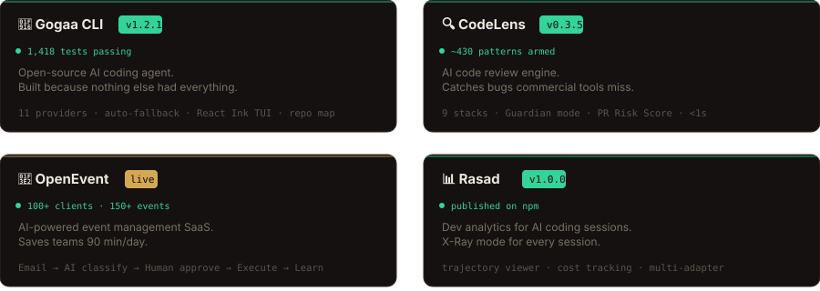

 

[`🌐 Portfolio — live AI agent`](https://ahtesham.dev.wadwarehouse.com) · [`💼 LinkedIn`](https://www.linkedin.com/in/muhammad-ahtesham-ahmad-a153801b5) · [`🟢 Upwork · 100%`](https://www.upwork.com/freelancers/~01bd0ab6e093ea2d49) · [`📧 Email`](mailto:shami8024@gmail.com)

---

---

### 🛠 Loaded Modules

  

**AI & ML** &nbsp; `Claude` · `OpenAI` · `Groq` · `pgvector` · `LangChain` · `RAG` · `Multi-Agent`

**Backend** &nbsp; `Supabase` · `PostgreSQL` · `FastAPI` · `Stripe` · `Edge Functions`

**Infra** &nbsp; `Docker` · `Traefik` · `GitHub Actions` · `Cloudflare` · `React Ink`

---

### 📊 System Telemetry

 

 

  

